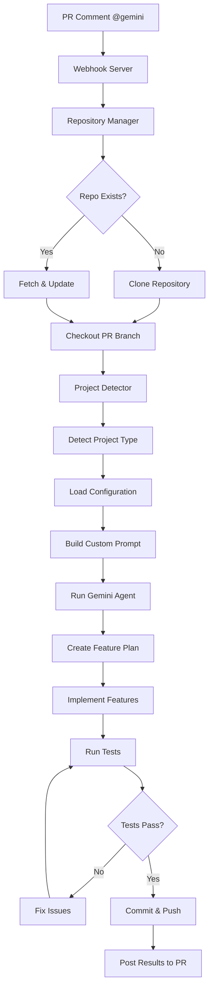

# 🏭 Gemini Coding Factory

A **multi-repository AI development infrastructure** that transforms your server into a coding factory powered by **Gemini CLI**. Simply comment `@gemini` on any GitHub repository to trigger automated feature development across **any project type**.

## 🎯 Multi-Repository Vision

This system acts as your **personal coding factory** that can handle:

### 🔧 **Any Project Type**
- **Frontend**: Next.js, React, Vue.js, Angular
- **Backend**: Node.js, Express, FastAPI, Django
- **Blockchain**: Hardhat, Foundry, Solidity contracts
- **Systems**: Rust, Go, Python, Docker projects
- **Generic**: Any codebase with automatic detection

### 🏗️ **Factory Architecture**
- **Central Orchestrator**: Manages multiple repositories
- **Smart Detection**: Automatically identifies project types
- **Repository Manager**: Clones, fetches, and manages repo branches
- **Composable Prompts**: Project-specific AI instructions
- **Multi-Testing**: Runs appropriate tests for each project type

### 🚀 **Production Ready**
- **Arch Linux Service**: Runs as systemd service on your server
- **Docker Support**: Complete containerized development environment
- **Webhook Driven**: Responds to GitHub events in real-time
- **Branch Aware**: Works with PR branches automatically
- **Multi-Tenant**: Handles multiple repositories simultaneously

## 🚀 Quick Start (Arch Linux Server)

### 1. Prerequisites

- **Arch Linux Server** with sudo access
- **Gemini API Key** (Google AI Studio or Vertex AI)
- **GitHub Personal Access Token** with repo access
- **Docker** (optional for development)
- **Node.js 18+** and npm

### 2. Installation

```bash
# Clone the repository
git clone https://github.com/wjorgensen/Gemini-team.git
cd Gemini-team

# Run the installation script
chmod +x deploy/install-arch.sh
./deploy/install-arch.sh
```

### 3. Configure Gemini CLI

The Gemini CLI needs authentication setup before the service can work. You have two options:

**Option A: Interactive Setup (Recommended)**
```bash
# Run the CLI configuration helper
chmod +x deploy/setup-gemini-cli.sh
./deploy/setup-gemini-cli.sh
```

**Option B: Manual Setup**
```bash
# Configure the CLI interactively
gemini configure

# When prompted:
# 1. Choose "Gemini API Key (AI Studio)"
# 2. Get your key from: https://aistudio.google.com/app/apikey
# 3. Paste your API key
# 4. Test with: gemini --version
```

### 4. Service Configuration

Edit the environment configuration:
```bash
sudo nano /etc/gemini-coding-factory/environment
```

Add your API keys:
```bash
GEMINI_API_KEY=your_gemini_api_key_here
GITHUB_TOKEN=your_github_token_here
WEBHOOK_SECRET=your_webhook_secret_here
AUTHORIZED_USERS=wjorgensen
```

### 5. Start the Service

```bash
# Enable and start the service
sudo systemctl enable gemini-coding-factory.service
sudo systemctl start gemini-coding-factory.service

# Check status
sudo systemctl status gemini-coding-factory.service
```

### 6. Set Up GitHub Webhooks

#### **Generate Webhook Secret**
```bash
# Generate a secure random secret
SECRET=$(openssl rand -hex 32)
echo "Webhook secret: $SECRET"

# Add it to your environment file
sudo nano /etc/gemini-coding-factory/environment
# Add: WEBHOOK_SECRET=your_generated_secret_here
```

#### **Configure Repository Webhooks**

For each repository you want to use with Gemini:

1. **Navigate to Repository Settings**
   - Go to your GitHub repository
   - Click **Settings** → **Webhooks** → **Add webhook**

2. **Configure Webhook Settings**
   - **Payload URL**: `http://your-server-ip:3000/webhook`
     - *Replace `your-server-ip` with your actual server IP*
     - *For local testing, use ngrok: `https://abc123.ngrok.io/webhook`*
   - **Content type**: `application/json`
   - **Secret**: Paste the webhook secret you generated above
   - **Which events**: Select **"Let me select individual events"**
     - ✅ **Issue comments** (this is what triggers Gemini)
     - ❌ Uncheck all other events

3. **Test the Webhook**
   - Click **Add webhook**
   - GitHub will send a test ping to your server
   - Check that you see a green ✅ in the webhook list

#### **For Local Development (No Port Forwarding)**

If you can't port forward, use **ngrok**:

```bash
# Install ngrok (using AUR helper like yay)
yay -S ngrok

# Create free account at https://ngrok.com and get your authtoken
ngrok authtoken YOUR_AUTHTOKEN

# Expose your local server
ngrok http 3000

# Use the generated URL in GitHub webhook settings
# Example: https://abc123.ngrok.io/webhook
```

### 7. Test Any Repository

1. **Create a PR** on any repository (Next.js, Rust, Solidity, etc.)
2. **Comment**: `@gemini Add user authentication with login and registration`
3. **Watch Magic**: Gemini detects the project type and implements the feature!

### 8. Troubleshooting

#### **Gemini CLI Issues**

| Problem | Solution |
|---------|----------|
| ❌ `GEMINI_API_KEY environment variable not found` | Run `gemini configure` or `./deploy/setup-gemini-cli.sh` |
| ❌ `gemini: command not found` | Install CLI: `sudo npm install -g @google/gemini-cli` |
| ❌ Authentication errors | Reconfigure: `gemini configure --reset` |
| ❌ API key invalid | Get new key from https://aistudio.google.com/app/apikey |

#### **Webhook Issues**

#### **Check Webhook Status**
```bash
# Check if service is running
sudo systemctl status gemini-coding-factory.service

# View real-time logs
sudo journalctl -u gemini-coding-factory.service -f

# Test webhook endpoint manually
curl -X POST http://localhost:3000/webhook -H "Content-Type: application/json" -d '{}'
```

#### **Common Issues**

| Problem | Solution |
|---------|----------|
| ❌ Webhook shows red X in GitHub | Check server is running and accessible |
| ❌ "Connection refused" | Verify port 3000 is open and service is running |
| ❌ "Invalid signature" | Ensure webhook secret matches in both GitHub and environment file |
| ❌ Nothing happens on `@gemini` comment | Check you're commenting on a PR (not issue) and user is authorized |
| ❌ Can't access from outside | Use ngrok or configure port forwarding |

#### **Test Webhook Delivery**
1. Go to your GitHub repository webhook settings
2. Click on your webhook
3. Scroll down to **Recent Deliveries**
4. Click on a delivery to see the request/response
5. Look for HTTP 200 status (success) or error details

## 📖 How It Works

### Multi-Repository Workflow



### Intelligent Project Detection

The system automatically detects project types by examining:

**Frontend Projects**
- Next.js (detects `next.config.js`, App Router)
- React (detects `package.json` with React)
- Vue.js (detects Vue dependencies)

**Backend Projects**  
- Node.js/Express (detects Express in `package.json`)
- FastAPI (detects `main.py` + `requirements.txt`)
- Django (detects `manage.py`)

**Blockchain Projects**
- Hardhat (detects `hardhat.config.js`)
- Foundry (detects `foundry.toml`)
- Raw Solidity (detects `.sol` files)

**Systems Projects**
- Rust (detects `Cargo.toml`)
- Go (detects `go.mod`)
- Python (detects `requirements.txt`)

### Composable Development Protocol

Each project type gets a customized protocol:

1. **Smart Analysis**
   - Analyzes codebase structure and patterns
   - Understands existing architecture
   - Identifies dependencies and constraints

2. **Project-Specific Planning**
   - Creates `feature-plan.md` with project-aware tasks
   - Uses framework-specific best practices
   - Plans appropriate testing strategy

3. **Intelligent Implementation**
   - Follows project conventions automatically
   - Uses correct testing frameworks
   - Applies proper linting and formatting

4. **Adaptive Testing**
   - Playwright for frontend projects
   - Jest/pytest for backend
   - Hardhat/Foundry tests for blockchain
   - Cargo test for Rust, go test for Go

5. **Quality Assurance**
   - Runs project-specific quality checks
   - Ensures code passes all existing tests
   - Maintains project coding standards

## 🎮 Multi-Repository Usage Examples

### Frontend Projects (Next.js/React)
```
@gemini Create a responsive user dashboard with:
- User profile management
- Dark mode toggle
- Real-time notifications
- Mobile-first design with Tailwind CSS
```

### Backend API Projects (Node.js/FastAPI)
```
@gemini Implement a REST API for user management:
- User registration and authentication
- JWT token handling
- Input validation and error handling
- Comprehensive test coverage
```

### Blockchain Projects (Hardhat/Foundry)
```
@gemini Create an ERC-721 NFT contract with:
- Minting functionality with role-based access
- Metadata support with IPFS integration
- Gas optimization
- Complete test suite with edge cases
```

### Systems Projects (Rust/Go)
```
@gemini Build a CLI tool for file processing:
- Command-line argument parsing
- Async file operations
- Error handling with proper logging
- Unit tests and documentation
```

### Docker Projects
```
@gemini Optimize the Docker setup:
- Multi-stage build optimization
- Security hardening
- Health checks
- Docker Compose for development
```

### Cross-Project Features
```
@gemini Add comprehensive logging:
- Structured logging with appropriate levels
- Log rotation and management
- Performance monitoring hooks
- Integration with existing architecture
```

## 🛠️ Local Development

### Using Docker (Recommended)

```bash
# Build and start the development environment
docker-compose up

# Or for specific profiles
docker-compose --profile testing up    # Include testing environment
docker-compose --profile webhook up    # Include webhook listener
```

### Manual Setup

```bash
# Install dependencies
npm install

# Install Playwright browsers
npm run setup

# Start development server
npm run dev

# Run tests
npm run test:e2e
```

### Testing the Agent Locally

```bash
# Build Docker image
npm run docker:build

# Run agent in container
npm run docker:run

# Test Gemini CLI integration
npm run gemini:test
```

## 📁 Project Structure

```
gemini-background-agent/
├── .github/workflows/
│   └── gemini.yml                 # GitHub Actions workflow
├── app/                           # Next.js app directory
│   ├── layout.tsx                # Root layout
│   ├── page.tsx                  # Homepage
│   └── globals.css               # Global styles
├── e2e/                          # Playwright E2E tests
│   ├── global-setup.ts           # Test setup
│   ├── global-teardown.ts        # Test cleanup
│   └── homepage.spec.ts          # Example test
├── scripts/
│   └── gemini-prompt-template.txt # Reusable prompt template
├── docker-compose.yml            # Docker services
├── Dockerfile                    # Container definition
├── package.json                  # Dependencies and scripts
├── playwright.config.ts          # Playwright configuration
├── GEMINI.md                     # Project guidelines for Gemini
└── README.md                     # This file
```

## ⚙️ Configuration

### Environment Variables

Create a `.env.local` file:

```bash
# Required
GEMINI_API_KEY=your_gemini_api_key_here
GITHUB_TOKEN=your_github_token_here

# Optional
NODE_ENV=development
BASE_URL=http://localhost:3000
WEBHOOK_SECRET=your_webhook_secret
```

### Customizing the Agent

1. **Project Guidelines**: Edit `GEMINI.md` to customize coding standards
2. **Prompt Template**: Modify `scripts/gemini-prompt-template.txt` for different behavior
3. **Workflow Triggers**: Adjust `.github/workflows/gemini.yml` for different trigger conditions

### Adding New Test Categories

Update `playwright.config.ts` to add new test configurations:

```typescript
projects: [
  {
    name: 'api-tests',
    testDir: './e2e/api',
    use: { ...devices['Desktop Chrome'] },
  },
  // ... other projects
]
```

## 🧪 Testing Strategy

### Test Categories

1. **Unit Tests**: Jest for component and utility testing
2. **E2E Tests**: Playwright for full user workflow testing
3. **Integration Tests**: API route and database interaction testing

### Running Tests

```bash
# All tests
npm test

# E2E tests only
npm run test:e2e

# E2E with UI
npm run test:e2e:ui

# E2E in headed mode (see browser)
npm run test:e2e:headed

# Debug mode
npm run test:e2e:debug
```

### Test Best Practices

- Use `data-testid` attributes for reliable element selection
- Test user behavior, not implementation details
- Keep tests independent and deterministic
- Use page object pattern for complex workflows

## 🔧 Troubleshooting

### Common Issues

**Gemini CLI not configured**
```bash
# Option 1: Use helper script
./deploy/setup-gemini-cli.sh

# Option 2: Manual configuration
gemini configure
```

**Gemini CLI not found**
```bash
sudo npm install -g @google/gemini-cli
```

**Environment variable not found error**
```bash
# Configure CLI authentication
gemini configure

# Or set environment globally
export GEMINI_API_KEY=your_key_here
```

**Playwright browsers missing**
```bash
npx playwright install --with-deps
```

**GitHub Action fails with permissions**
- Ensure `GEMINI_API_KEY` is set in repository secrets
- Check that the GitHub token has appropriate permissions

**Tests fail locally but pass in CI**
- Check viewport and timing differences
- Ensure test data is properly isolated
- Verify network conditions

### Debug Mode

Enable debug logging:

```bash
DEBUG=pw:* npm run test:e2e  # Playwright debug
NODE_ENV=development npm run dev  # Next.js debug
```

## 🤝 Contributing

1. Fork the repository
2. Create a feature branch
3. Test your changes locally
4. Submit a PR with a clear description

### Development Workflow

1. **Local Testing**: Use `@gemini` comments on test PRs
2. **Docker Testing**: Validate in containerized environment
3. **Documentation**: Update README for new features

## 📚 Advanced Usage

### Multiple Agents (Future)

The architecture supports running multiple Gemini agents in parallel:

```yaml
# In GitHub Actions
strategy:
  matrix:
    agent: [frontend, backend, testing]
```

### Custom MCP Tools

Integrate additional MCP (Model Context Protocol) tools:

```bash
# Example: Add database MCP tool
npm install @mcp/database-tools
```

### Webhook Integration

For real-time local development:

```bash
# Start webhook listener
docker-compose --profile webhook up
```

## 📄 License

MIT License - see [LICENSE](LICENSE) file for details.

## 🆘 Support

- **Issues**: [GitHub Issues](https://github.com/wjorgensen/gemini/issues)
- **Discussions**: [GitHub Discussions](https://github.com/wjorgensen/gemini/discussions)
- **Documentation**: This README and `GEMINI.md`

---

**Built with ❤️ using Gemini CLI, Next.js, TypeScript, Tailwind CSS, and Playwright** 